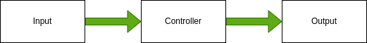

# Project x_x: Closing the Loop
This assignment will guide you through a positional PID closed loop control. 

*** Pre-req: *** 
- Must have completed previous robot projects
- Have controlled a robot/motor with open loop control

## *** Closed Loop Control ***
### What is Closed Loop Control
In simple words, closed loop control just means that you are keeping track of what your motor is actually doing and using that to adjust your input to the motor so that you get your desired outcome.

*** Quick review of open loop control: *** 

Where the input is your desired state to for the motor to be in (a position or a speed), the controller is the motor controller (SPARKMAX, TalonFX, etc.), and your output is the actual output of the motor in reality (which may different from the desired state because of friction, etc.)

*** Quick overview of closed loop control: ***

In closed loop control, we "close" this control flow by using an encoder, which is a device that measures how many rotations that a motor have done. Below is some encoders that we have used:
- [Integrated Falcon 500 Encoders](https://store.ctr-electronics.com/falcon-500-powered-by-talon-fx/)
- [Integrated NEO Encoders](https://www.revrobotics.com/rev-21-1650/)
- [CANCoders](https://store.ctr-electronics.com/cancoder/)
- [TalonSRX MagEncoders](https://store.ctr-electronics.com/srx-mag-encoder/)

From this rotation data, you can deduce the distance, velocity, and acceleration data of the motor via simple derivatives (just taking the [slope](https://www.youtube.com/watch?v=nUb7xfkc0Ac)). Since these encoders will report the ***current state*** of the motor (whether that'd be the current position, velocity, etc.), given the ***input/desired state*** (the desired state we want the motor to be at), we can find the ***error***. 

Then ***PID*** is used to reduce this error in an efficent manner. Remember that this error is aribitrary, it could be a positional error (distance) or a velocity error (speed), or other errors. (You should have recieved a lecture on PID at the robotics room during training sessions)
- [Review of PID](https://www.youtube.com/watch?v=wkfEZmsQqiA&t=10s)

A high-level understanding of PID should be enough to get you started. You can dive [deeper into the math](https://www.youtube.com/watch?v=JEpWlTl95Tw) once you have a solid understanding of calculus, specifically derivatives and integrals.

For now, we will focus on tuning PID.

### How to Tune a PID Controller
- [In depth guide](https://www.crossco.com/resources/technical/how-to-tune-pid-loops/
- [Basics](https://realpars.com/pid-tuning/)

To be honest, at this point, tuning PID is all about ***guess and check*** until the output looks around what you want. We do not have a fancy automated or mathematical way to perfectly tune PID controllers. We usually just guess the kP, kI, and kD gains.

However, some good strategies can be used when you are "guessing" these values:
- Never tune 1 or more gains at the same time.
- Start with all gains set to zero.
- Now ***only increase kP*** until your motor reaches the setpoint, but is most likely unstable (jiggles/oscilaltes alot). Find this minimum kP that will allow your motor to reach the setpoint (if you are at a kP where you think its good, try to decrease it to see if it will stil reach the setpoint. If yes, it means your current kP is still not the lowest it can be at)
- Now ***only increase kD*** until your motor begins to experince less and less oscillation until you find a combination that minimizes osciallation and maximizes setpoint accuracy (low error)
- We generally do not touch ***kI*** for various reasons. One of which is that it introduces more unstableness and also because we don't have a great way to guess/tune it.

### Unit Conversions
Encoders, depending on who created the software, may return measurements that are in units that are different from your conventions. For instance, the TalonFX API returns encoder measurements in terms of native units (raw encoder ticks). Thus, unit conversions must be done correctly to get from ***ticks*** to meters. 

You will have to look up documentation on the motor's specific ***ticks per  motor rotation*** for position native output or ***ticks per unit time*** for velocity measurements to start your conversion process. 
- (e.g.) [TalonFX returns in 2048 ticks per rotation for position and ticks/100ms for velocity](https://store.ctr-electronics.com/falcon-500-powered-by-talon-fx/)
From here on, using unit conversion rules of cancelling out units, you should slowly find your way over to your desired units by using conversion factors. 

For example, say I wanted meters for position:

$\frac{ticks}{rotation} * \frac{meter}{ticks} = \frac{meters}{rotation}$

- [Guide to Unit Conversion](https://www.youtube.com/watch?v=eK8gXP3pImU)

## ***Robot Code Requirements***
- Use the ***2022 Mini Bot's drivetrain*** chasis for this project (this robot uses Falon 500s/TalonFX)
	- Get familiar with [TalonFX Docs](https://docs.ctre-phoenix.com/en/stable/) and the features of TalonFXs
	- Ensure that all hardware is working on the robot
	- Suspend the robot on a box so it will not run away
	- TalonFX by default use the integrated encoders in the Falcon 500 motors, thus if using `.getSelectedSensorPosition()` method of the `TalonFX` object will return you the raw encoder ticks that the motor has traveled.
	- TalonFX PID values are set through the config of the motor. [Read More] (https://docs.ctre-phoenix.com/en/stable/ch16_ClosedLoop.html#closed-loop-configurations) Or refer to 2022 constants files.
	- Setpoint positions on the TalonFX can be set using the `.set(TalonFXControlMode controlMode, double setpoint)`. For closed loop, the control mode wil always be closed loop. Remember that the set point here will be in terms of ***native encoder values*** so remember to convert back from desired units to ticks.
- ***Print out the distance the robot has traveled after running motor in teleop***
- ***Tune positional PID so that you can set the motor to a specific angle in degrees***
	- Where angle should be inputted on the SmartDashBoard or through a variable in the code

